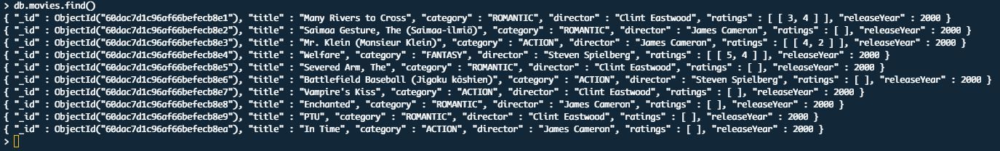
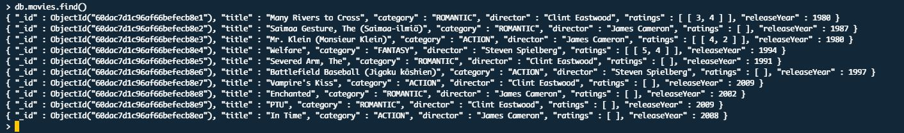

# **MongoDB alapfeladatok terminálban (Mongo shell-ben)**

Elsőként olvasd végig az összes pontot!

1. Készíts egy videoStore nevű MongoDB adatbázist!

    ```
    use videoStore
    ```

2. Hozz létre benne egy movies listát!

    ```
    db.createCollection("movies",  {
        validator: {
            $jsonSchema: {
              required: ["title", "category", "director"],
              properties: {
                  title: {bsonType: "string"},
                  category: {
                      enum: ["fantasy", "action", "romantic"],
                      description: "required and must be one of the enum values"
                  },
                  director: {
                      enum: ["Steven Spielberg", "Clint Eastwood", "James Cameron"],
                      description: "required and must be one of the enum values"
                  }
              }
           }
        }
    })
    ```

3. Ments el benne 10 új filmet (save()) a következő mezőkkel:
    - _id: legyen generált, ObjectId
    - title: egy-egy kedvenc film címe, szöveges tartalom
    - category: szöveges tartalom (3 típus lehet: fantasy, action, romantic) => legyenek vegyesen a filmek, amennyire lehet
    - director: szöveges tartalom, 3 rendező közül vegyesen szétválogatva => Steven Spielberg, Clint Eastwood, James Cameron

    .save() segítségével egyesével:

    ```jsx
    db.movies.save({
      "title": "Many Rivers to Cross",
      "category": "romantic",
      "director": "Clint Eastwood"
    })

    db.movies.save({
      "title": "Saimaa Gesture, The (Saimaa-ilmiö)",
      "category": "romantic",
      "director": "James Cameron"
    })

    db.movies.save({
      "title": "Mr. Klein (Monsieur Klein)",
      "category": "action",
      "director": "James Cameron"
    })

    db.movies.save({
      "title": "Welfare",
      "category": "fantasy",
      "director": "Steven Spielberg"
    })

    db.movies.save({
      "title": "Severed Arm, The",
      "category": "romantic",
      "director": "Clint Eastwood"
    })

    db.movies.save({
      "title": "Battlefield Baseball (Jigoku kôshien)",
      "category": "action",
      "director": "Steven Spielberg"
    })

    db.movies.save({
      "title": "Vampire's Kiss",
      "category": "action",
      "director": "Clint Eastwood"
    })

    db.movies.save({
      "title": "Enchanted",
      "category": "romantic",
      "director": "James Cameron"
    })

    db.movies.save({
      "title": "PTU",
      "category": "romantic",
      "director": "Clint Eastwood"
    })

    db.movies.save({
      "title": "In Time",
      "category": "action",
      "director": "James Cameron"
    })
    ```

    .insertMany() segítségével egyszerre:

    ```jsx
    db.movies.insertMany(
    [{
      "title": "Many Rivers to Cross",
      "category": "romantic",
      "director": "Clint Eastwood"
    }, {
      "title": "Saimaa Gesture, The (Saimaa-ilmiö)",
      "category": "romantic",
      "director": "James Cameron"
    }, {
      "title": "Mr. Klein (Monsieur Klein)",
      "category": "action",
      "director": "James Cameron"
    }, {
      "title": "Welfare",
      "category": "fantasy",
      "director": "Steven Spielberg"
    }, {
      "title": "Severed Arm, The",
      "category": "romantic",
      "director": "Clint Eastwood"
    }, {
      "title": "Battlefield Baseball (Jigoku kôshien)",
      "category": "action",
      "director": "Steven Spielberg"
    }, {
      "title": "Vampire's Kiss",
      "category": "action",
      "director": "Clint Eastwood"
    }, {
      "title": "Enchanted",
      "category": "romantic",
      "director": "James Cameron"
    }, {
      "title": "PTU",
      "category": "romantic",
      "director": "Clint Eastwood"
    }, {
      "title": "In Time",
      "category": "action",
      "director": "James Cameron"
    }]
    )
    ```

4. Frissítsd a listádat (updateMany), mindenki kapjon egy „ratings” mezőt, amely egy üres listát tartalmaz (1-5 ig lehet benne tárolni a szavazatokat)!

    ```jsx
      db.movies.updateMany(
      {},
      {$set: {ratings: [] }}
    )
    ```

5. Adj 3 különböző filmre legalább 2 különböző szavazatot (használd a $push operátort)!

    ```jsx
    db.movies.update(
      { title: "Many Rivers to Cross" },
      { $push: { ratings: [ 3, 4 ] } }
    )

    db.movies.update(
      { title: "Mr. Klein (Monsieur Klein)" },
      { $push: { ratings: [ 4, 2 ] } }
    )

    db.movies.update(
      { title: "Welfare" },
      { $push: { ratings: [ 5, 4 ] } }
    )
    ```

6. Adj hozzá minden filmhez egy „releaseYear” (megjelenés éve) mezőt: kezdetnek állíts be egy tetszőleges évet minden filmnek (pl.: 2000)!

    ```jsx
    db.movies.updateMany(
      {},
      {$set: {releaseYear: 2000 }}
    )
    ```

7. Írd át category típusonként csupa nagybetűre a kategóriákat (pl.: action ==> ACTION legyen mindenhol). Használd az updateMany parancsot!

    ```jsx
    db.movies.updateMany(
      { category: "action" },
      {$set: {category: "ACTION" }}
    )

    db.movies.updateMany(
      { category: "romantic" },
      {$set: {category: "ROMANTIC" }}
    )

    db.movies.updateMany(
      { category: "fantasy" },
      {$set: {category: "FANTASY" }}
    )
    ```

8. Kérdezd le az adatokat, hogy ellenőrizd, sikeresek lettek-e a frissítések! Most így kellene kinéznie a listának:

    

    

9. Kicsit **algoritmizáljunk**! Nézd meg, hogy melyik könyvtárban állsz a pwd() parancs segítségével. Hozz létre egy .js kiterjesztésű szöveges fájlt az adott könyvtárban! (Használhatsz majd abszolút elérési utat is később.) Bármilyen szerkesztő, IDEA megfelelő a szerkesztésre. Készíts el benne egy függvényt (ne felejtsd el meghívni a fájl végén), amely tartalmazzon egy listát benne a **te filmjeid** címeivel (figyelj a pontos címek megadására). Kiindulásként egy kis „segédkép”:

    

    ```jsx
    const setYearToMovies = () => {
        const titles = [
            'Many Rivers to Cross',
            'Saimaa Gesture, The (Saimaa-ilmiö)',
            'Mr. Klein (Monsieur Klein)',
            'Welfare',
            'Severed Arm, The',
            'Battlefield Baseball (Jigoku kôshien)',
            "Vampire's Kiss",
            'Enchanted',
            'PTU',
            'In Time',
        ];
        
    };

    setYearToMovies();
    ```

10. Folytasd a script írását! Cél, hogy mindegyik film különböző éveket kapjon az adatbázisban, de a filmek hármasával egy évtizedben legyenek. Törekedj a funkcionális egyszerű kódra. Futtasd le a Mongo shell-ben a scriptet a load() parancs segítségével. Utána kérdezd le az adatbázisodat ellenőrizni az eredményt. Íme egy lehetséges elvárt eredmény:

    ```jsx
    const setYearToMovies = () => {
        
        const titles = [
            "Many Rivers to Cross",
            "Saimaa Gesture, The (Saimaa-ilmiö)",
            "Mr. Klein (Monsieur Klein)",
            "Welfare",
            "Severed Arm, The",
            "Battlefield Baseball (Jigoku kôshien)",
            "Vampire's Kiss",
            "Enchanted",
            "PTU",
            "In Time",
        ];

        let year = 0;

        const randomIntFromInterval = (min, max) => {
            return Math.floor(Math.random() * (max - min + 1) + min);
        };

        // mivel a művelet nem ad vissza értéket, a .map() helyett .forEach() metódust használok
        titles.forEach((item, index) => {
            if (index < 3) {
                year = randomIntFromInterval(1980, 1989);
            } else if (index < 6) {
                year = randomIntFromInterval(1990, 1999);
            } else {
                year = randomIntFromInterval(2000, 2009);
            }
            db.movies.update({ title: item }, { $set: { releaseYear: year } });
        });
    };

    setYearToMovies();

    // load("setMoviesYear.js")

    /*
    Másik megoldás: index értéke alapján számolva az év

        const randomYearByIndex = index => {
            return 1980 + (index % 3) * 10 + Math.floor(Math.random() * 10);
        };

        // mivel a művelet nem ad vissza értéket, a .map() helyett .forEach() metódust használok
        titles.forEach((item, index) => {
            db.movies.update(
                { title: item },
                { $set: { releaseYear: randomYearByIndex(index) } }
            );
        });
    */
    ```
    
    
