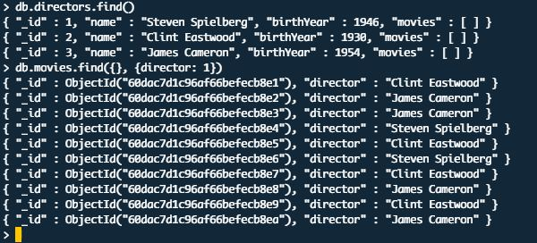
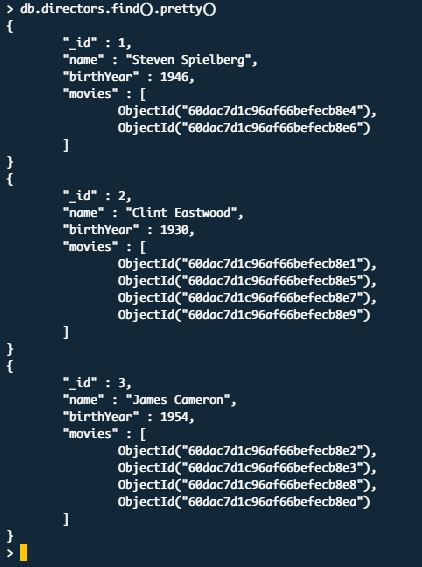

# **A videoStore feladat folytatása (update, find, projection)**

**Normalization elve:** Csak a közvetlen összetartozó elemeket tároljuk egy táblázatban (listában). Minél összetettebb egy adat (több tulajdonsággal rendelkezhet, pl.: rendezőnek lehet neve, díjai, filmjei, születési adatai), annál inkább külön listába kell kiszervezni a tárolását.

1. Készíts el egy „directors” listát, amelyben filmrendezőket fogunk tárolni!

    ```
    use videoStore
    db.createCollection("directors")
    ```

2. Ments el benne 3 „rendező” dokumentumot az **insertOne()** parancs segítségével:
    - "_id": egész szám 1-estől indulva
    - "name": Steven Spielberg, Clint Eastwood, James Cameron
    - "birthYear": születési év (tetszőlegesen megadott egész szám)
    - "movies": kezdetben egy üres lista

    ```
    db.directors.insertOne(
        {
          _id: 1,
          name: "Steven Spielberg",
          birthYear: 1946,
          movies: []
        }
    )

    db.directors.insertOne(
        {
          _id: 2,
          name: "Clint Eastwood",
          birthYear: 1930,
          movies: []
        }
    )

    db.directors.insertOne(
        {
          _id: 3,
          name: "James Cameron",
          birthYear: 1954,
          movies: []
        }
    )
    ```

3. Frissítsd a rendezők dokumentumait, helyezd el a „movies” listájukba a megfelelő filmek id-jait (ha ObjectId-t használsz, akkor figyelj arra, hogy ObjectId-ként mentsd el őket). Tipp: kérdezd le a rendezőket, és alájuk listázd a filmeket úgy, hogy csak az id-jük és a rendező nevét adja vissza a lekérdezés:

    

    
    
    ```
    ObjectId hozzáadása egyenként:

    db.directors.update(
        { name: "Steven Spielberg" },
        { $push: { movies: ObjectId("60dac7d1c96af66befecb8e4")}} 
    )

    db.directors.update(
        { name: "Steven Spielberg" },
        { $push: { movies: ObjectId("60dac7d1c96af66befecb8e6")}} 
    )

    ObjectId hozzáadása $each segítségével:

    db.directors.update(
      { name: "Clint Eastwood" },
      { $push: { 
          movies: { 
            $each: [
              ObjectId("60dac7d1c96af66befecb8e1"),
              ObjectId("60dac7d1c96af66befecb8e5"),
              ObjectId("60dac7d1c96af66befecb8e7"),
              ObjectId("60dac7d1c96af66befecb8e9") 
            ]
          }
        } 
      }
    )

    db.directors.update(
      { name: "James Cameron" },
      { $push: { 
          movies: { 
            $each: [
              ObjectId("60dac7d1c96af66befecb8e2"),
              ObjectId("60dac7d1c96af66befecb8e3"),
              ObjectId("60dac7d1c96af66befecb8e8"),
              ObjectId("60dac7d1c96af66befecb8ea") 
            ]
          }
        } 
      }
    )
    ```

4. Ha frissítetted a rendezőket, ellenőrzés gyanánt kérdezd le a dokumentumokat a „directors” listából (használd a pretty() metódust a szebb megjelenítéshez)! Ehhez hasonló eredményt kell látnod:

    

    

5. **Ha elkészültél a rendezői listával**, frissítsd a movies listát („táblázatot”): távolítsd el a director mezőt ($unset operátor segítségével). Ezentúl a rendezőn keresztül fogjuk elérni a hozzájuk tartozó filmeket.

    ```
    db.movies.updateMany( {} , {$unset: {director: 0 } } )
    ```

6. Kérdezd le az egy bizonyos év előtt készült filmeket, majd az egy bizonyos év után készült filmeket! ($gt, $gte, $lt, $lte)

    ```
    db.movies.find( { releaseYear: {$gt: 2002} } )
    db.movies.find( { releaseYear: {$gte: 1991} } )
    db.movies.find( { releaseYear: {$lt: 2000} } )
    db.movies.find( { releaseYear: {$lte: 1980} } )
    ```

7. Kérdezz le két év között készült filmeket! (Próbáld ki $and operátorral is!)

    ```
    db.movies.find( { releaseYear: {$gte: 1980, $lte: 1990} } )

    db.movies.find( { $and: [ 
                        { releaseYear: { $gte: 1980 } },
                        { releaseYear: { $lte: 1990 } }
                      ]
    } )

    ```

8. Kérdezz le két év közötti filmeket, amelyek egy bizonyos kategóriával rendelkeznek!

    ```
    db.movies.find( { $and: [ 
                        { releaseYear: { $gte: 1980 } },
                        { releaseYear: { $lte: 1990 } },
                        { category: "ROMANTIC" }
                      ]
    } )
    ```

9. Kérdezd le a filmeket, amelyeknek a kategóriája NEM fantasy ($ne)!

    ```
    db.movies.find( { $and: [ 
                        { releaseYear: { $gte: 1990 } },
                        { releaseYear: { $lte: 2000 } },
                        { category: { $ne: "FANTASY" } }
                      ]
    } )
    ```

**Projection:** egy lekérdezés során van, hogy érzékeny adatainkat nem akarjuk elküldeni, vagy csak nincs okunk minden tulajdonságot lekérni egy dokumentumról. A szerveroldalról megjelenített adatok kezelése ezt a célt szolgálja.

1. Írj egy lekérdezést, amely visszaadja az egy konkrét időpont előtt készült filmek címét és kategóriáját (más mező ne jelenjen meg), amelyeknek a kategóriája „ROMANTIC” vagy „ACTION” ($in operátor vagy $or operátor is).

    ```
    db.movies.find( 
        { $and: [  
                { releaseYear: {$lte: 2000} },
                { $or: [
                        { category: "ROMANTIC" },
                        { category: "ACTION" }
                  ] }
          ]
        },
        { _id: 0, title: 1, category: 1 }
    )
    ```

2. Írj egy lekérdezést a directors listára, amelyben elkéred a rendezők nevét és a filmek _id-ját (más mező ne jelenjen meg).

    ```
    db.directors.find({}, {_id: 0, name: 1, movies: 1})
    ```

3. Írj egy lekérdezést, amely visszaadja a Steven Spielberg filmrendező által rendezett filmek adatait, kivéve a ratings-et. (Most elég, ha lekérdezed először a rendező film id-jait, majd a fő lekérdezésben megadott paraméterként az id-kat).
    ```
    ```
**Adatbázis importálása .json fájlból**

Adatbázisokkal történő munkák során gyakran előfordulhat, hogy biztonsági mentéseket kell végezni vagy különböző fájlokból kell importálni adatbázisba adatokat. Ehhez az egyik fő eszköz a „MongoDB DataBase Tool”, azon belül most a mongoimport segítségével fogunk gyakorolni.

DataBase Tool: külön package-ben kell telepíteni a MongoDB egy újabb verziója óta. (Windows esetén érdemes lehet a MongoDB könyvtára „közelébe vagy mellé” telepíteni.)

Windows: [https://docs.mongodb.com/database-tools/installation/installation-windows/](https://docs.mongodb.com/database-tools/installation/installation-windows/)

Ubuntu: [https://docs.mongodb.com/database-tools/installation/installation-linux/](https://docs.mongodb.com/database-tools/installation/installation-linux/)

Mac: [https://docs.mongodb.com/database-tools/installation/installation-macos/](https://docs.mongodb.com/database-tools/installation/installation-macos/)

Ellenőrizzük, hogy sikeresen települt:

Ubuntu, Mac => parancs a terminálban (nem a Mongo shell-ben): mongoimport --version

Windows => meg kell keresnünk a terminálban a telepítés helyét, lépjünk be a bin könyvtárba, hogy lássuk a települt fájlokat. (Itt is futtatható már a mongoimport --version parancs.)


**mongoimport** parancs segítségével tudunk CSV, JSON fájlból importálni adatbázist.

1. Ubuntun a terminálban (nem Mongo shell-ben!). Keressünk egy könyvtárat, ahová el akarjuk menteni az adatbázist, majd a terminálban írjuk be az alábbi parancsot:
wget [https://raw.githubusercontent.com/mongodb/docs-assets/primer-dataset/primer-dataset.json](https://raw.githubusercontent.com/mongodb/docs-assets/primer-dataset/primer-dataset.json)
WINDOWS estén keressük fel az oldalt: majd az oldalon jobb egér klikk, mentés másként, hogy lementsük a tartalmat.
2. Utána mehet a parancs a terminálokban:
**Ubuntu:** sudo mongoimport --db newdb --collection restaurants --file primer-dataset.json
**Windows:** meg kell keresni a DataBase Tool forrás könyvtárát, és ott mehet a parancs:


**Parancsok:**

- mongoimport: importálj adatokat a MongoDB szerverre
- -db "newdb": a newdb nevű adatbázisba (ha nincs ilyen a gépen, létrehozza)
- -collections restaurant: a „restaurants” listába mentse az adatokat
- -file primer-dataset.json: a primer-dataset.json fájlból

Megjegyzés: a parancs végére a relatív vagy teljes elérési utat kell írni, ha más könyvtárban lenne a .json fájl.

1. Ellenőrizzük parancsokkal, hogy sikerült-e az import:
- use newdb
- db.restaurants.count() (számolja meg, hány elemünk van)


**Gyakorlás nagyobb tömegű adatokon**

1. Kérdezzük le a restaurants listánkból a Brooklyn kerületben („borough”) lévő éttermek neveit, címét és kerületét. Az egyedi azonosító ne jelenjen meg! Használjuk a pretty() parancsot az olvashatóbb megjelenítéshez!

    ```
    db.restaurants.find({borough: "Brooklyn"}, {_id:0, name: 1, "address.street":1, "address.zipcode": 1, }).pretty()
    ```

2. Kérdezd le a Queens kerületben lévő olyan éttermek neveit, kerületét és a kapott osztályzatait („grades”), amelyeknek a nevében benne van a „Kitchen” szó (tipp: használd a $regex operátort)!

    ```
    db.restaurants.find(
      {
        name: { $regex: /kitchen/i },
        borough: "Queens"
      },
      {
        _id:0, name: 1,
        "address.zipcode": 1,
        "grades.grade":1
      }
    ).pretty()
    ```

3. Ellenőrzés gyanánt számold meg, hány darab van belőlük! Ismételd meg a fenti parancsot, a pretty() parancs helyet használd a count() parancsot! 144 étteremnek kell lennie.

    ```
    db.restaurants.find(
      {
        name: { $regex: /kitchen/i },
        borough: "Queens"
      },
      {
        _id:0, name: 1,
        "address.zipcode": 1,
        "grades.grade":1
      }
    ).count()
    ```

4. Kérdezd le azokat az éttermeket, amelyeknek a konyhája („cuisine”) NEM amerikai és az Astoria Boulevard utcában vannak. A szerver csak a cuisine és az address mezőket adja vissza.

    ```
    db.restaurants.find(
      {
        cuisine: { $ne: "American"},
        "address.street": "Astoria Boulevard"
      },
      {
        _id:0, 
        cuisine: 1,
        address: 1,
      }
    ).pretty()
    ```

5. Kérdezd le azokat az éttermeket, amelyek pizzát („pizza”) árulnak és NEM a következő kerületekben vannak: Brooklyn, Queens, Manhattan!

    ```
    db.restaurants.find(
      {
        cuisine: "Pizza",
        borough: { $nin: ["Brooklyn", "Queens", "Manhattan"]},
      },
      {
        _id:0, 
        name: 1,
        borough: 1,
      }
    )
    ```

6. Kérdezd le azoknak az éttermeknek a címét és nevét, amelyeknek a nevében benne van a „Pizza” szó és az irányítószámuk: 11369!

    ```
    db.restaurants.find(
      {
        name: { $regex: /pizza/i },
        "address.zipcode": "11369"
      },
      {
        _id:0, 
        name: 1,
        address: 1
      }
    )
    ```

7. Számold meg, hány „Tony”-val kezdődő névvel rendelkező étterem van az adatbázisban! (40 db a helyes válasz)

    ```
    db.restaurants.find(
      {
        name: { $regex: /^Tony/ig }
      }
    ).count()

    Az eredmény erre a keresésre: 32
    ```

Játssz tovább az adatbázissal tetszőlegesen! Találj ki további lekérdezéseket!